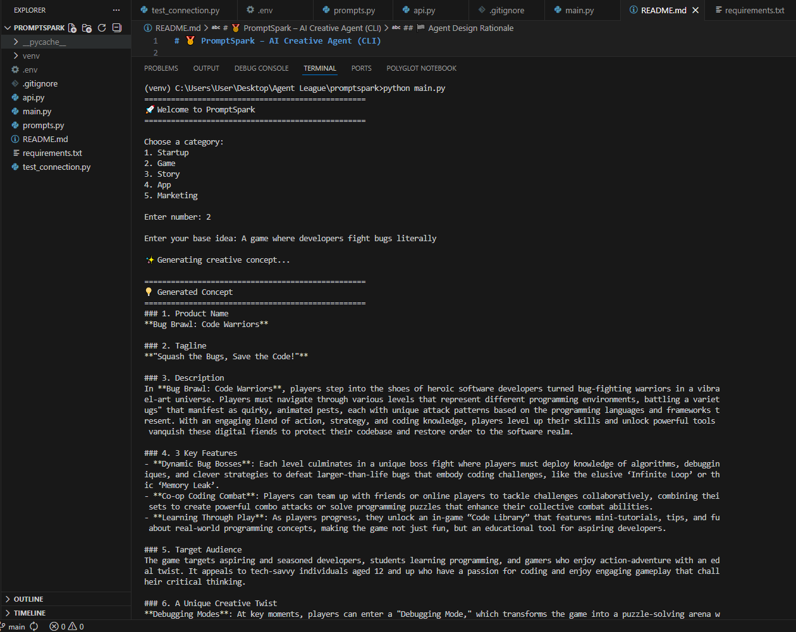

# 🥇 PromptSpark – AI Creative Agent (CLI)

PromptSpark is a lightweight AI-powered creative agent built in Python.

It transforms simple human input into structured, innovative product concepts using prompt engineering and modular AI integration.

Designed specifically as a fast, reliable MVP for AI agent prototyping.

## 📸 CLI Demo

Below is an example of PromptSpark generating a structured game concept from a simple idea:



---

## 🤖 Agent Concept

PromptSpark acts as a **Creative Ideation Agent**.

It receives:
- A category
- A base concept

And autonomously generates:
- Product Name
- Tagline
- Description
- Key Features
- Target Audience
- Unique Twist

The agent interprets vague ideas and turns them into pitch-ready concepts.

---

## 🧠 Agent Architecture

```
User → CLI Interface → Prompt Builder → AI Model → Structured Output
```

### Modules

- `main.py` → Agent orchestration & user interaction
- `prompts.py` → Prompt engineering layer (agent instructions)
- `api.py` → LLM communication layer
- `.env` → Secure key management

This separation allows:
- Agent evolution
- Multi-agent expansion
- Model swapping
- Web deployment

---

## 🎯 Why This Is an AI Agent

PromptSpark qualifies as an agent because it:

- Interprets intent
- Applies structured reasoning via prompt design
- Produces multi-part autonomous output
- Can be extended with memory or tool usage
- Separates orchestration from intelligence layer

It is not just a script calling an API — it is an orchestrated creative agent.

---

## ⚙️ Tech Stack

- Python 3
- OpenAI API
- dotenv
- Modular architecture
- CLI-based UX

---

## 🚀 Run Instructions

```
python main.py
```

---

## 🧪 Prompt Engineering Strategy

The agent uses structured prompts that:

- Constrain output format
- Encourage creativity with realism
- Avoid generic responses
- Force multi-dimensional idea generation

The design ensures reproducible, pitch-ready output.

---

## 🔥 Future Agent Evolution

With more time, PromptSpark can evolve into:

- Multi-agent system (Idea Agent + Critic Agent)
- Memory-enabled idea refinement
- Scoring & ranking system
- Web-based AI ideation studio
- Autonomous idea iteration loop

---

## 🏁 Agent Design Rationale

PromptSpark demonstrates:

- Practical AI agent design
- Prompt engineering skills
- Modular architecture
- Secure environment handling
- Rapid MVP execution

It showcases how to build focused, task-oriented AI agents with minimal complexity and maximum clarity.

---

✨ Built for AI Agent prototyping  
✨ Structured creativity engine  
✨ Modular by design